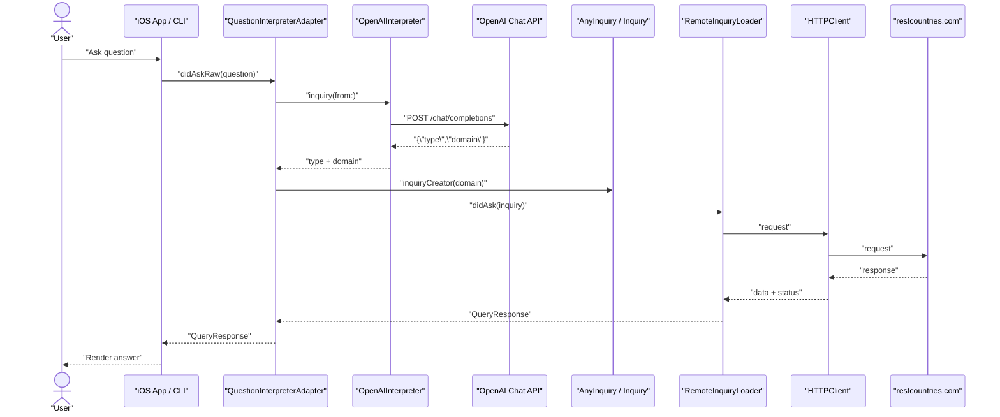

# CountryGuru

Chat-like iOS app and terminal CLI that answer country-related questions using a modular core library.

## Tech Stack

- **Language**: Swift (async/await)
- **UI**: SwiftUI (iOS app)
- **Networking**: `URLSession` via `URLSessionHTTPClient`
- **Core Module**: `CountryGuruCore` (domain, composition, networking)
- **AI Interpreter**: OpenAI Chat Completions API driven by `OpenAIInterpreter`
- **Tests**: Unit + Integration (including OpenAI API integration tests)

## What the iOS App Does

- Presents a chat UI where you can ask country-related questions
- Classifies your question with `OpenAIInterpreter` into a supported inquiry type
- Loads the answer from data sources (e.g., Rest Countries API) via the core module
- Shows answers as text, images (flags), or lists, with loading and retry states

## What the CLI App Does

- Accepts a question from the terminal and prints the answer
- Uses the same `CountryGuruCore` composition as the iOS app

## Supported Inquiries (examples)

- What is the capital of [Country]?
- What is the flag of [Country]?
- What countries start with [letters]?
- What is the ISO alpha-2 country code for [Country]?

The app uses OpenAI (via `OpenAIInterpreter`) to understand free-form natural language and classify it into one of the supported inquiry categories, also extracting the relevant domain (e.g., the country name or prefix).

## Architecture Overview

## Repository Structure

- `CountryGuruCore/`: Core framework shared by iOS and CLI
  - `Domain/`: Inquiry models, interpreter protocols, `OpenAIInterpreter`
  - `Network/`: `HTTPClient` protocol, `URLSessionHTTPClient`, loaders
  - `Main/`: App composition (`CountryGuruComposer`)
- `CountryGuru/`: iOS app (SwiftUI views + view models)
- `CountryGuruCLI/`: CLI tool using the same core
- `CountryGuruCoreTests/`, `CountryGuruCoreIntegrationTests/`: Tests

### Core Abstractions (CountryGuruCore)

- **`Inquiry` protocol**: Represents a specific question type. Each inquiry knows how to build its request and map a network response to a `QueryResponse`.
- **`InquiryType` enum**: Enumerates supported inquiries and provides prompt examples used by the AI with `promptExample`.
- **`AnyInquiry`**: Type-erased wrapper holding the `InquiryType` and an `InquiryCreator` closure to produce concrete `Inquiry` instances from a domain string.
- **`InquiryInterpreter` protocol`**: Translates a raw user question into a concrete `Inquiry`. Implemented by `OpenAIInterpreter`.
- **`OpenAIInterpreter`**: Calls the OpenAI Chat API with a compact prompt, returning the chosen `InquiryType` and extracted domain (e.g., country name or prefix). The prompt includes:
  - A dynamic list of supported classifications derived from injected inquiries
  - Examples sourced from `InquiryType.promptExample`
  - A strict JSON-only response format
- **`HTTPClient` protocol`**: Abstraction over GET/POST requests with error mapping via `HTTPClientError`.
- **`URLSessionHTTPClient`**: Concrete implementation using `URLSession` with centralized error mapping.
- **`RemoteInquiryLoader`**: Executes the request produced by an `Inquiry` and maps the result to a `QueryResponse`.
- **`CountryGuruComposer`**: Wires everything together (inquiries, interpreter, loader, http client) and exposes reusable factory methods for apps.

### iOS App (SwiftUI)

- **View Models**: Drive the UI state machine (`processing`, `success`, `error`, `notSupported`)
- **Views**: Present chat bubbles, images, loading and retry states, and an input bar following Apple’s HIG
- **Flow**:
  1. User types a question and submits
  2. `OpenAIInterpreter` classifies and extracts the domain
  3. Core creates the matching `Inquiry` via `AnyInquiry.inquiryCreator`
  4. `RemoteInquiryLoader` fetches data and returns a `QueryResponse`
  5. View updates accordingly (text, image, list, error, or not supported)

### CLI

- Composed with the same `CountryGuruComposer`
- Reads a line from stdin, resolves the inquiry and prints the response

## Error Handling

- Errors from networking are mapped to `HTTPClientError` (e.g., `timeout`, `notFound`, `invalidRequest`, `serverError`, `other`)
- The interpreter throws `InquiryInterpreterError.notSupported` for unrecognized questions or malformed AI responses
- UI shows retry affordances and helpful messages

## Prompts and Token Efficiency

- System prompt is compact and deterministic
- Classifications are injected from the active `inquiries` (no unused labels)
- Examples come from `InquiryType.promptExample` to guide the model while minimizing tokens
- Response must be strict JSON: `{ "type": "...", "domain": "..." }`

## Setup & Run

### Requirements

- Xcode 15+ (Swift 5.9+)
- iOS 17+ (target can be adjusted if needed)

### iOS App

1. Open `CountryGuru.xcworkspace` in Xcode
2. Select the `CountryGuru` scheme
3. Run on a simulator or device

### CLI

1. Open `CountryGuruCLI/CountryGuruCLI.xcodeproj`
2. Select the `CountryGuruCLI` scheme
3. Run (or `swift run` if you create a SwiftPM target in the future)

### OpenAI API Key

- The core uses an API key provided by `CountryGuruComposer` for the `OpenAIInterpreter`
- For production, prefer loading from environment or the Keychain and avoid committing secrets

## Testing

- Unit tests for networking, inquiries, and composition in `CountryGuruCoreTests`
- Integration tests in `CountryGuruCoreIntegrationTests` (may hit external APIs). Configure your API key and network permissions accordingly

## Privacy & Networking

- External calls: OpenAI Chat Completions API and `restcountries.com`
- No analytics or tracking built-in
- Consider showing a privacy notice if shipping to App Store

## Contributing

- Issues and PRs welcome. Please include tests and follow the existing code style (clarity, explicit naming, early returns, minimal comments).

---

If you have questions about extending the set of inquiries or swapping interpreters (e.g., CoreML), see `InquiryType`, `InquiryInterpreter`, and `CountryGuruComposer` for integration points.

## Request/Response Flow

